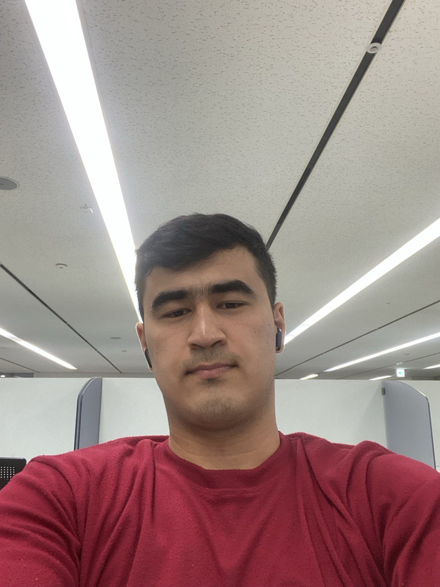

# Welcome to My Portfolio

{: style="border-radius:50%; max-width:200px; margin:20px auto; display:block;"}

Hello! I'm **Hoshimov Mirzohamidullo**, a Junior Data Scientist and student at Woosong University (Daejeon, Korea).  
I'm passionate about Machine Learning, Computer Vision, Natural Language Processing, and Recurrent Neural Networks.  
Welcome to my portfolio!

---

## Experience

•	Junior Data Scientis at FynexAI                 August 2025 – Present               Khujand city, Tajikistan
•	Data Collection & Validation                     
•	Modeling
•	Statistician at Genius Sports                   June 2024 – January 2025            Daejeon city, South Korea
•	Data Collection                        
•	Tabular Data Analysis
•	Sales Executive at Williams Sonoma              May 2021 – February 2022            Dubai, United Arab Emirates
•	Provided high-quality customer service.
•	Administrative tasks, including daily sales analysis & delivery system management. 
👉 [Download Resume (DOCX)](Resume_EN.docx)

---

## Education

•	Bachelor of Convergence Management (Business Administration):
Woosong University - Daejeon, South Korea              March 2022 - Present
•	Expected graduating 2026 August.
•	Multiple-courses competition winner.
•	CGPA: 4.4/4.5.
•	Graduating top 1%.
•	Bachelor of Finance and Accounting:
Institute of Economy and Trade  (IET TSUC)-            September 2020 – January 2021
Khujand, Tajikistan                                                             
•	CGPA: 3.7/4.0.
•	Gymnasium №4 – Khujand, Tajikistan:                  September 2009 – June 2020   •	GPA: 5.0/5.0. 

---

## Contact

- 📧 Email: hoshimovmirzohamidullo@gmail.com  
- 🌐 GitHub: [Hafizulloevich](https://github.com/Hafizulloevich)  
- 💼 LinkedIn: [LinkedIn Profile](https://www.linkedin.com/in/hoshimov/)

---
